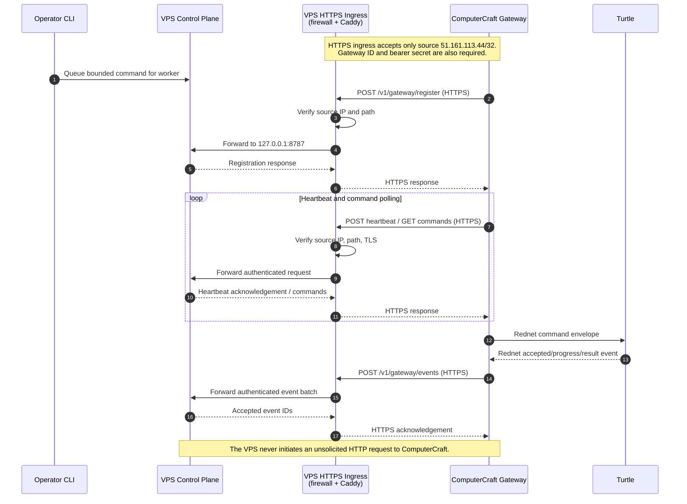

# Public HTTPS Connectivity Sequence

The gateway, not the VPS, initiates every HTTP connection. The VPS sends commands in responses
to the gateway's poll; the turtle communicates only with the local gateway over Rednet.

Current gateway URL: `https://192-99-69-46.sslip.io:8443`.

## Boundary summary

- The public boundary is HTTPS port 8443 on the VPS proxy, not the Node.js control-plane port.
- TCP port 8787 is bound only to the private Docker bridge on the VPS.
- The firewall and proxy restrict the public endpoint to `51.161.113.44/32`.
- HTTPS protects the gateway bearer secret in transit; the bearer secret authenticates the
  gateway after network admission.
- The turtle does not access the internet or VPS directly.
